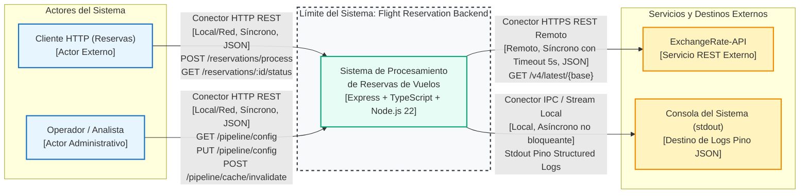
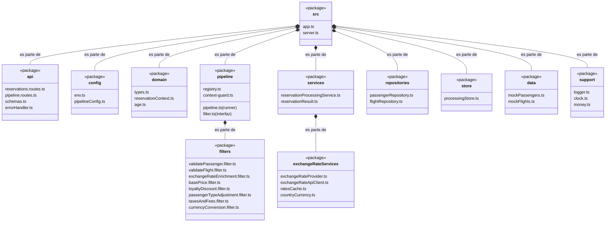
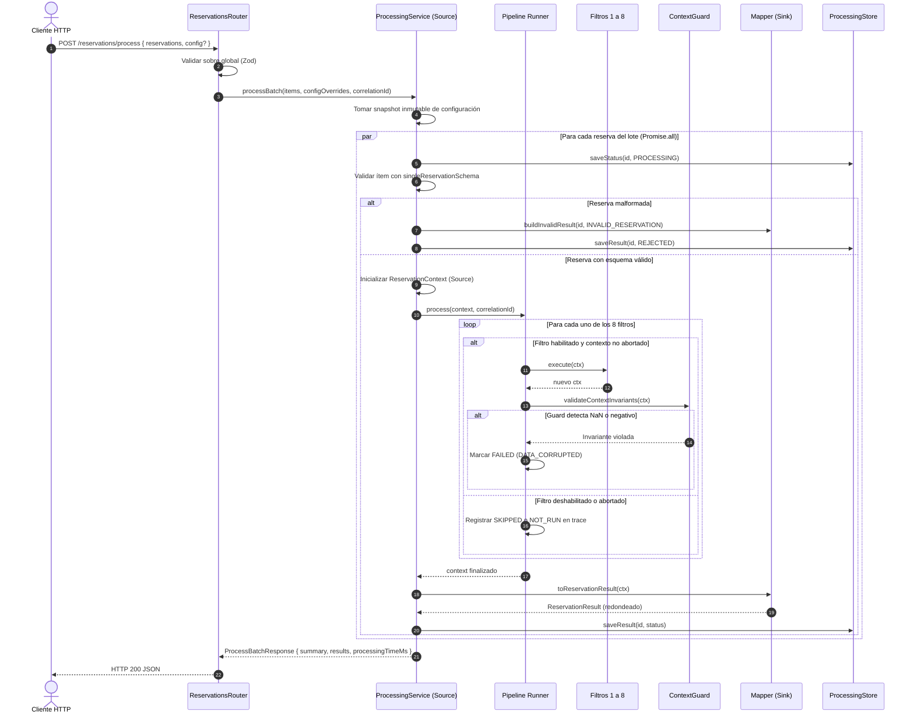
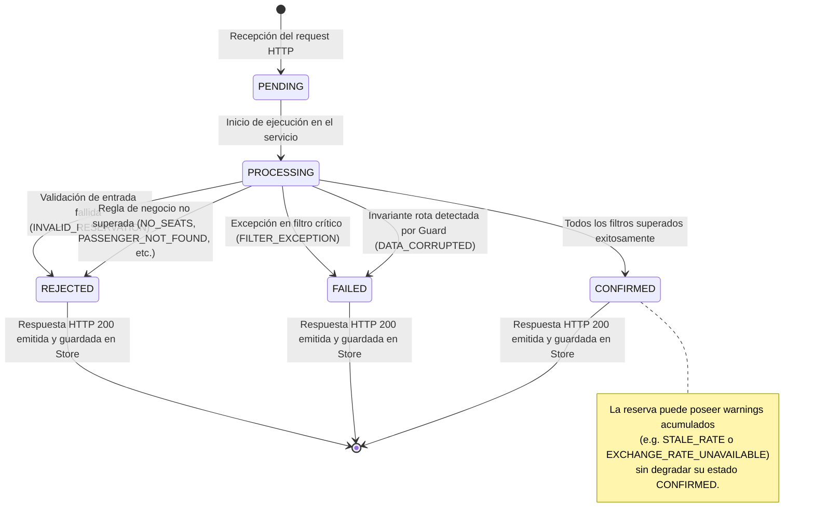
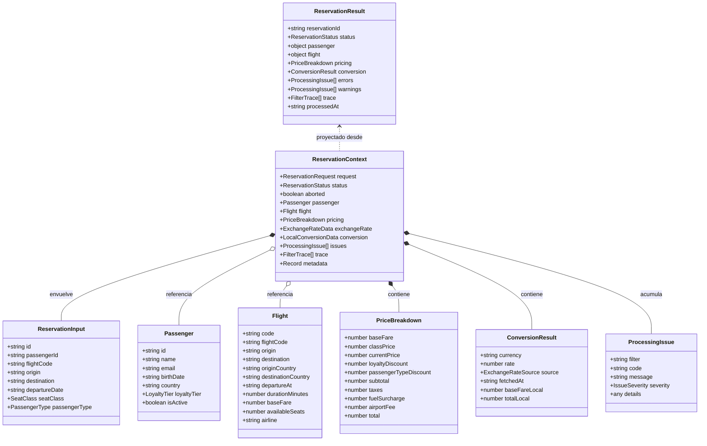

# Sistema de Reservas de Vuelos (Pipes & Filters)
## Descripción de Arquitectura de Software (SADP 2.0)

- **Proyecto:** Sistema de Procesamiento de Reservas de Vuelos
- **Materia:** FI-3851 Arquitectura de Software — Tecnología (Universidad ORT Uruguay, 2026-2)
- **Fecha de elaboración:** 17 de setiembre de 2026
- **Autores:** Equipo de Arquitectura y Construcción FI-3851
- **Estado del documento:** Aprobado / Confirmado con código real de implementación

---

### Índice de Contenidos

1. [Introducción](#1-introducción)
   - 1.1 [Propósito](#11-propósito)
   - 1.2 [Guía de lectura y organización](#12-guía-de-lectura-y-organización)
2. [Antecedentes](#2-antecedentes)
   - 2.1 [Propósito del sistema](#21-propósito-del-sistema)
   - 2.2 [Requerimientos significativos de arquitectura](#22-requerimientos-significativos-de-arquitectura)
     - 2.2.1 [Resumen de requerimientos funcionales (RF)](#221-resumen-de-requerimientos-funcionales)
     - 2.2.2 [Resumen de atributos de calidad (AC) y restricciones (RS)](#222-resumen-de-requerimientos-de-atributos-de-calidad-y-restricciones)
     - 2.2.3 [Escenarios detallados de atributos de calidad](#223-escenarios-detallados-de-atributos-de-calidad)
3. [Documentación de la Arquitectura](#3-documentación-de-la-arquitectura)
   - 3.1 [Diagrama de contexto (D1)](#31-diagrama-de-contexto)
   - 3.2 [Vistas de módulos](#32-vistas-de-módulos)
     - 3.2.1 [Vista de descomposición (D2)](#321-vista-de-descomposición)
     - 3.2.2 [Vista de uso y vista de layers (D3)](#322-vista-de-uso-y-vista-de-layers)
     - 3.2.4 [Catálogo de elementos de módulos](#324-catálogo-de-elementos-de-módulos)
     - 3.2.5 [Interfaces de módulos](#325-interfaces-de-módulos)
     - 3.2.6 [Comportamiento en vistas de módulos (D4, D5, D6 y D7)](#326-comportamiento-en-vistas-de-módulos)
   - 3.3 [Vistas de componentes y conectores (C&C)](#33-vistas-de-componentes-y-conectores)
     - 3.3.1 [Representación primaria (D8)](#331-representación-primaria)
     - 3.3.2 [Catálogo de elementos C&C](#332-catálogo-de-elementos-cc)
     - 3.3.3 [Interfaces C&C](#333-interfaces-cc)
     - 3.3.4 [Comportamiento C&C](#334-comportamiento-cc)
     - 3.3.5 [Relación con elementos lógicos](#335-relación-con-elementos-lógicos)
     - 3.3.6 [Decisiones de diseño y guía de variabilidad](#336-decisiones-de-diseño-y-guía-de-variabilidad)
   - 3.4 [Vistas de asignación](#34-vistas-de-asignación)
     - 3.4.1 [Vista de despliegue (D9)](#341-vista-de-despliegue)
     - 3.4.2 [Vista de instalación](#342-vista-de-instalación)
4. [Anexos](#4-anexos)
   - [Anexo A: Atributo → Táctica → Tecnología](#anexo-a-atributo--táctica--tecnología)
   - [Anexo B: Matriz de trazabilidad](#anexo-b-matriz-de-trazabilidad)
   - [Anexo C: Uso de Inteligencia Artificial](#anexo-c-uso-de-inteligencia-artificial)
   - [Anexo D: Glosario](#anexo-d-glosario)

---

## 1. Introducción

El presente documento describe la arquitectura de software del Sistema de Procesamiento de Reservas de Vuelos, implementado en Node.js y TypeScript bajo el patrón arquitectónico Pipes & Filters. Sigue el estándar de documentación **SADP 2.0** (*Software Architecture Description Pattern*), complementado con las directivas de vistas de Merson (SEI) y las normas de la cátedra de Arquitectura de Software de la Universidad ORT Uruguay (2026-2).

### 1.1 Propósito

El propósito del presente documento es proveer una especificación completa de la arquitectura del Sistema de Reservas de Vuelos, justificando técnica y empíricamente las decisiones estructurales, los patrones aplicados, las tácticas de control de atributos de calidad y sus correspondientes trade-offs, con el fin de servir como base de diseño, evaluación de calidad y defensa académica.

### 1.2 Guía de lectura y organización

El documento está estructurado para satisfacer los intereses de diversos lectores:
- **Evaluadores y arquitectos:** las secciones 2.2, 3.1, 3.3 y el Anexo A exponen los *drivers* arquitectónicos, los escenarios de calidad y la correspondencia entre atributos, tácticas y tecnologías.
- **Desarrolladores y mantenedores:** las secciones 3.2 (vistas de módulos), 3.3.6 (guía de variabilidad) y 3.4 (instalación y despliegue) detallan la estructura de paquetes, contratos de interfaz, puntos de extensión e instrucciones operativas.
- **Trazabilidad y gobernanza:** los anexos B y C y los Registros de Decisiones de Arquitectura ([`docs/adr/`](../adr/)) justifican el porqué de cada solución frente a las alternativas descartadas.

Todas las descripciones reflejan estrictamente el **código fuente implementado en `src/`**, con verificación en verde mediante compilación estricta (`tsc`) y linteo (`eslint`). Las métricas que no han sido medidas en entornos productivos se declaran explícitamente como `Pendiente de validación`.

---

## 2. Antecedentes

### 2.1 Propósito del sistema

El sistema constituye el motor de backend encargado de procesar solicitudes de reservas aéreas remitidas en lotes en formato JSON. El procesamiento demanda aplicar reglas de negocio heterogéneas: verificar la vigencia y datos del pasajero, constatar la existencia y cupo del vuelo, obtener cotizaciones de moneda extranjera en tiempo real mediante un proveedor externo, computar tarifas escalonadas según cabina, lealtad y edad, liquidar impuestos fiscales y recargos aeronáuticos, y convertir los importes a la divisa del país de destino.

#### Usuarios y actores
1. **Cliente HTTP:** aplicación cliente o interfaz de reservas que envía lotes de 1 a 100 reservas al endpoint `POST /reservations/process` y consulta estados específicos mediante `GET /reservations/:id/status`.
2. **Operador / Administrador:** rol técnico u operativo que consulta y modifica parámetros y activación de filtros en caliente mediante `GET/PUT /pipeline/config` e invalida la memoria intermedia de cotizaciones a través de `POST /pipeline/cache/invalidate`.
3. **Proveedor de Tipo de Cambio (ExchangeRate-API):** servicio externo REST que suministra cotizaciones actualizadas para conversión de divisas.

#### Alcance del sistema
- **Dentro del alcance:** recepción sincrónica de lotes vía REST; validación sintáctica y semántica con esquemas Zod; canalización por 8 filtros secuenciales independientes; inyección de dependencias; tolerancia a fallos ante caídas del proveedor de divisas; cálculo determinista de precios; almacenamiento volátil acotado (1000 estados); logging estructurado con Pino y correlación por request.
- **Fuera del alcance:** persistencia relacional o en base de datos externa; decremento transaccional de inventario de asientos en aerolíneas; pasarela de pagos; autenticación y autorización; escalado horizontal multi-instancia.

#### Documentos relacionados
- Consigna de la cátedra: `docs/plan/CONSIGNA.md`
- Plan de construcción aprobado: `docs/plan/PLAN.md`
- Reglas de diseño y documentación de la cátedra: `docs/plan/REGLAS-CATEDRA.md`
- Decisiones arquitectónicas: `docs/adr/` (ADR-001 al ADR-008)

---

### 2.2 Requerimientos significativos de arquitectura

#### 2.2.1 Resumen de requerimientos funcionales

| ID | Descripción | Actor |
|---|---|---|
| **RF 1** | **Procesar lote de reservas:** Recibe un sobre de 1 a 100 reservas, ejecuta la tubería de filtros para cada una de forma concurrente y retorna el resumen de lote, desglose de tarifas, errores, warnings y el tiempo total transcurrido. | Cliente HTTP |
| **RF 2** | **Validar pasajero:** Verifica existencia en catálogo mock, estado activo, formato de email y coherencia entre edad cumplida a la fecha del vuelo y tipo de pasajero declarado. | Sistema (Filtro 1) |
| **RF 3** | **Validar vuelo:** Constata existencia de código de vuelo, disponibilidad de asientos (`availableSeats > 0`), coincidencia de ruta y fecha de partida futura. | Sistema (Filtro 2) |
| **RF 4** | **Enriquecer con tipo de cambio:** Detecta la moneda local del país de destino y obtiene la tasa de cambio vigente consultando la API externa o la caché en memoria. | Sistema (Filtro 3) |
| **RF 5** | **Calcular precio:** Aplica tarifa por clase de cabina, deducciones encadenadas de lealtad y edad, impuestos fiscales, tasa aeroportuaria fija y sobrecargo de combustible. | Sistema (Filtros 4 a 7) |
| **RF 6** | **Consultar estado:** Permite recuperar el estado y resultado del procesamiento reciente de una reserva individual mediante su identificador único. | Cliente HTTP |
| **RF 7** | **Ver configuración:** Consulta la configuración vigente del pipeline, parámetros tarifarios y el orden inmutable de los filtros habilitados. | Operador |
| **RF 8** | **Modificar configuración:** Habilita o deshabilita filtros y ajusta multiplicadores o tasas en caliente con efecto inmediato a partir del lote siguiente. | Operador |
| **RF 9** | **Invalidar caché:** Permite purgar manualmente la caché de cotizaciones en memoria forzando una nueva consulta externa en las solicitudes subsiguientes. | Operador |

#### 2.2.2 Resumen de requerimientos de atributos de calidad y restricciones

| ID Requerimiento | ID Atributo / Restricción | Descripción |
|---|---|---|
| RF 4 | **AC 1 Disponibilidad** | Si la API de tipo de cambio no responde o falla, el lote debe completarse exitosamente con advertencias legibles y precios en USD (degradación controlada). |
| RF 1, RF 8 | **AC 2 Modificabilidad** | Se debe poder añadir o retirar un filtro sin modificar el orquestador (`Pipeline`) ni los demás filtros. |
| RF 8 | **AC 3 Modificabilidad (en ejecución)** | Las modificaciones de configuración vía API deben regir inmediatamente para nuevos lotes sin reiniciar el servidor y sin alterar lotes en curso. |
| RF 1 | **AC 4 Disponibilidad (aislamiento de fallos)** | Una excepción técnica o dato anómalo en una reserva debe aislarse en esa reserva (estado `FAILED`), procesando las demás normalmente. |
| RF 4 | **AC 5 Rendimiento** | La consulta de tasas debe optimizarse mediante caché en memoria y técnica de solicitud única (*single-flight*) para evitar peticiones redundantes. |
| Todos | **AC 6 Testeabilidad** | Todos los filtros, repositorios y servicios deben ser testeables unitariamente de forma determinista y sin acceso a la red. |
| RF 1 | **AC 7 Confiabilidad de entrada** | Las reservas individuales malformadas dentro de un sobre válido se rechazan puntualmente sin abortar el resto del lote. |
| — | **RS 1 Tecnología** | Implementación obligatoria en Node.js (>= 22), TypeScript (modo estricto) y Express.js. |
| — | **RS 2 Estilo arquitectónico** | Uso preceptivo del patrón Pipes & Filters en proceso con filtros en orden predeterminado. |
| — | **RS 3 Datos en memoria** | Datos de prueba precargados en memoria (`mockPassengers.ts`, `mockFlights.ts`), sin base de datos relacional externa. |
| — | **RS 4 Integración externa** | Integración con servicio público ExchangeRate-API v4 gratuito sin requerimiento de API keys; importes base fijados en USD. |
| — | **RS 5 Entregables** | Entrega de código fuente, suite de pruebas automatizadas, colección Postman con respuestas guardadas y documentación técnica. |
| — | **RS 6 Organizacional** | Cumplimiento de pautas de entrega, registro transparente del uso de IA y preparación para defensa oral presencial individual. |

---

### 2.2.3 Escenarios detallados de atributos de calidad

A continuación se especifican los 7 escenarios de arquitectura bajo el formato canónico de 6 partes de Bass et al.:

```markdown
### AC 1 — Disponibilidad: Tolerancia y degradación ante caída de la API de tipo de cambio
| Parte | Valor |
|---|---|
| Fuente | Servicio externo ExchangeRate-API |
| Estímulo | La API no responde (timeout 5000 ms), arroja errores HTTP 5xx o falla la red en todos sus reintentos |
| Artefacto | Proveedor de tasas (`ExchangeRateApiClient`), caché (`RatesCache`) y filtro 3 (`exchangeRateEnrichment`) |
| Entorno | Operación normal en tiempo de ejecución, caché inicialmente vacía |
| Respuesta | El sistema agota un máximo de 3 intentos con backoff; si existe tasa previa vencida en memoria la utiliza con warning `STALE_RATE`; si no hay tasa disponible, continúa la reserva en USD emitiendo warning `EXCHANGE_RATE_UNAVAILABLE` |
| Medida de respuesta | 100% de las reservas del lote finalizan con estado procesado (`CONFIRMED`); respuesta HTTP 200; 0 errores 500 al cliente; máximo de 3 intentos y <= 16 s de espera acumulada por lote (no por reserva individual gracias a single-flight). Tiempo de respuesta global en degradación: Pendiente de validación en infraestructura de producción |

**Tácticas que lo satisfacen:** Detección de fallas (timeout con `AbortSignal`), Reintento con retroceso exponencial y jitter, Degradación grácil (*stale-cache* o divisa base USD), Solicitud única compartida (*single-flight*).  
**ADRs relacionados:** [ADR-003](../adr/ADR-003-fallos-criticidad-pipeline.md), [ADR-005](../adr/ADR-005-integracion-tipo-de-cambio.md).  
**Test que lo verifica:** `tests/integration/qualityScenarios.test.ts` (suite AC 1) y `tests/integration/consignaCases.test.ts`.
```

```markdown
### AC 2 — Modificabilidad: Adición de un filtro nuevo sin modificar el runner
| Parte | Valor |
|---|---|
| Fuente | Desarrollador de software / Diseñador |
| Estímulo | Se solicita incorporar una nueva etapa al pipeline (e.g. auditoría o nuevo cálculo tarifario) |
| Artefacto | Pipeline runner (`src/pipeline/pipeline.ts`), catálogo y filtros |
| Entorno | Tiempo de diseño y construcción |
| Respuesta | El desarrollador crea la clase o fábrica que implementa la interfaz `Filter` y la registra en el mapa de configuración |
| Medida de respuesta | 0 líneas modificadas en `src/pipeline/pipeline.ts`; 0 líneas modificadas en los filtros preexistentes; <= 4 archivos tocados para registro y configuración (`registry.ts`, `pipelineConfig.ts`, tipos y el nuevo archivo de filtro); esfuerzo de codificación <= 0.5 días-persona |

**Tácticas que lo satisfacen:** Encapsulamiento, Interfaz abstracta uniforme (`Filter`), Bajo acoplamiento mediante inversión de dependencias.  
**ADRs relacionados:** [ADR-001](../adr/ADR-001-pipes-and-filters.md), [ADR-006](../adr/ADR-006-configuracion-inmutable-snapshot.md).  
**Test que lo verifica:** `tests/integration/qualityScenarios.test.ts` (suite AC 2).
```

```markdown
### AC 3 — Modificabilidad en ejecución: Actualización de configuración en caliente
| Parte | Valor |
|---|---|
| Fuente | Operador del sistema / Administrador |
| Estímulo | Petición `PUT /pipeline/config` modificando el estado de activación de filtros o parámetros de precios |
| Artefacto | Almacén de configuración (`PipelineConfigStore`), orquestador y servicio de reservas |
| Entorno | Sistema en ejecución con lotes de reservas procesándose activamente |
| Respuesta | La nueva configuración se valida con Zod y reemplaza atómicamente el estado global; los lotes en curso finalizan con el snapshot con el que iniciaron, y los lotes siguientes adoptan la nueva configuración de inmediato |
| Medida de respuesta | 0 reinicios del servidor; 0 lotes con políticas tarifarias inconsistentes o mezcladas; efectividad a partir del request inmediatamente posterior |

**Tácticas que lo satisfacen:** Vinculación diferida (*runtime configuration*), Snapshot inmutable por lote, Reemplazo atómico de estado.  
**ADRs relacionados:** [ADR-002](../adr/ADR-002-contexto-inmutable-guard-fronteras.md), [ADR-006](../adr/ADR-006-configuracion-inmutable-snapshot.md).  
**Test que lo verifica:** `tests/integration/qualityScenarios.test.ts` (suite AC 3).
```

```markdown
### AC 4 — Disponibilidad: Aislamiento de fallos y excepciones no controladas
| Parte | Valor |
|---|---|
| Fuente | Excepción imprevista de software o dato anómalo dentro de un filtro |
| Estímulo | Un filtro arroja un error no capturado o produce valores incompatibles durante el cómputo de una reserva |
| Artefacto | Orquestador `Pipeline` y monitor de invariantes `context-guard` |
| Entorno | Procesamiento concurrente de un lote de N reservas |
| Respuesta | El orquestador captura la excepción; si el filtro es crítico o falla el guard, marca la reserva afectada como `FAILED` con código `FILTER_EXCEPTION` o `DATA_CORRUPTED`, aborta los pasos siguientes de esa reserva registrándolos como `NOT_RUN`, y procesa las N-1 reservas restantes sin interrumpir el proceso Node.js |
| Medida de respuesta | El 100% de las N-1 reservas válidas se procesa normalmente; respuesta HTTP 200 global con estado discriminado en el array `results`; 0 caídas del proceso servidor |

**Tácticas que lo satisfacen:** Aislamiento de fallos (*fault containment*), Supervisión de invariantes de contexto, Clasificación de criticidad de componentes.  
**ADRs relacionados:** [ADR-002](../adr/ADR-002-contexto-inmutable-guard-fronteras.md), [ADR-003](../adr/ADR-003-fallos-criticidad-pipeline.md).  
**Test que lo verifica:** `tests/integration/qualityScenarios.test.ts` (suite AC 4) y `tests/pipeline/context-guard.test.ts`.
```

```markdown
### AC 5 — Rendimiento: Optimización de consultas a la API mediante caché y single-flight
| Parte | Valor |
|---|---|
| Fuente | Cliente HTTP |
| Estímulo | Recepción de un lote de 100 reservas con destinos en divisas extranjeras (e.g. BRL, EUR, ARS) |
| Artefacto | Componente de caché (`RatesCache`) y cliente HTTP (`ExchangeRateApiClient`) |
| Entorno | Sistema en operación normal, escenario de caché fría y posteriormente caché caliente |
| Respuesta | Con caché fría, las peticiones concurrentes del lote se consolidan en una única promesa de red saliente (*single-flight*); con caché caliente, todas las conversiones se resuelven instantáneamente en memoria |
| Medida de respuesta | Exactamente 1 llamada HTTP a la API externa por moneda base con la caché fría; 0 llamadas a la API durante la ventana de TTL de 1 hora con caché caliente; tiempo de resolución del lote en memoria local: Pendiente de validación en entorno de pruebas de carga formal |

**Tácticas que lo satisfacen:** Mantenimiento de copias de datos (Caché en memoria con TTL), Solicitud consolidada (*single-flight* promise sharing).  
**ADRs relacionados:** [ADR-005](../adr/ADR-005-integracion-tipo-de-cambio.md).  
**Test que lo verifica:** `tests/integration/qualityScenarios.test.ts` (suite AC 5) y `tests/services/ratesCache.test.ts`.
```

```markdown
### AC 6 — Testeabilidad: Verificación unitaria e integral determinista sin dependencias de red
| Parte | Valor |
|---|---|
| Fuente | Desarrollador o servidor de integración continua |
| Estímulo | Ejecución del comando de validación técnica (`typecheck`, `lint` y suite de pruebas automatizadas) |
| Artefacto | Toda la base de código (`src/` y `tests/`) |
| Entorno | Estación de trabajo local o runner CI/CD completamente aislado de internet |
| Respuesta | Todos los componentes se instancian con stubs, mocks y relojes inyectados (`Clock`, `ExchangeRateProvider`, repositorios en memoria), verificando la totalidad de reglas y contratos sin emitir tráfico de red |
| Medida de respuesta | 100% de las pruebas automatizadas ejecutadas en verde sin acceso a internet; cobertura >= 80% en líneas y ramas; 0 llamadas reales a endpoints externos en tests |

**Tácticas que lo satisfacen:** Inyección de dependencias en constructores y fábricas, Abstracción mediante interfaces (DIP), Eliminación de fuentes no deterministas (`Clock` abstracto en lugar de `new Date()`).  
**ADRs relacionados:** [ADR-001](../adr/ADR-001-pipes-and-filters.md), [ADR-005](../adr/ADR-005-integracion-tipo-de-cambio.md).  
**Test que lo verifica:** Suite de pruebas en `tests/` y verificación de tipos con `tsc`.
```

```markdown
### AC 7 — Confiabilidad de entrada: Rechazo granular de datos malformados
| Parte | Valor |
|---|---|
| Fuente | Cliente HTTP |
| Estímulo | Solicitud `POST /reservations/process` conteniendo un lote donde una o más reservas presentan datos corruptos o tipos inválidos, junto con reservas conformes |
| Artefacto | Esquema de validación Zod (`singleReservationSchema`) y servicio de procesamiento (`ReservationProcessingService`) |
| Entorno | Operación normal |
| Respuesta | Cada reserva se valida independientemente antes de entrar a la tubería; las reservas defectuosas se identifican de inmediato como `REJECTED` con código `INVALID_RESERVATION` y detalle de campos en `errors`, retornando HTTP 200 global con el procesamiento completo de las reservas válidas |
| Medida de respuesta | 0 excepciones no controladas; 0 rechazos de reservas válidas adyacentes; HTTP 400 únicamente ante violación estructural del sobre global (`reservations` no array o vacío); HTTP 200 en lotes mixtos con detalle individual por ítem |

**Tácticas que lo satisfacen:** Validación rigurosa en fronteras de entrada (*Input Validation* con Zod), Aislamiento de ítems en procesamiento de lotes.  
**ADRs relacionados:** [ADR-002](../adr/ADR-002-contexto-inmutable-guard-fronteras.md).  
**Test que lo verifica:** `tests/integration/qualityScenarios.test.ts` (suite AC 7) y `tests/api/schemas.test.ts`.
```

---

## 3. Documentación de la Arquitectura

El sistema adopta como patrón estructurador principal **Pipes & Filters**, integrado armónicamente con:
- **Layers (Capas estrictas):** desacoplamiento vertical unidireccional sin saltos de capa.
- **Repository:** abstracción de las colecciones de datos en memoria para pasajeros y vuelos.
- **Adapter / Anticorruption Layer (ACL):** aislamiento de la API de tipo de cambio detrás de la interfaz `ExchangeRateProvider`.
- **Decorator:** enriquecimiento transparente del proveedor con responsabilidades de almacenamiento en caché y *single-flight*.

---

### 3.1 Diagrama de contexto

El diagrama de contexto presenta al sistema como una caja negra delimitada, ilustrando todas sus interacciones con actores externos y el protocolo y sincronismo de sus conectores.



**Leyenda de notación del Diagrama de Contexto:**
- **Rectángulos azules:** Actores humanos o aplicaciones cliente consumidoras.
- **Rectángulo verde:** Límite del sistema evaluado (caja negra ejecutada en Node.js).
- **Rectángulos amarillos:** Servicios o destinos externos al límite del software.
- **Flechas simples:** Dirección de la invocación (quien inicia la solicitud apunta a quien la atiende; la respuesta viaja por el mismo canal). No se emplean flechas dobles.
- **Conectores locales vs remotos:** Se distingue explícitamente entre llamadas remotas por red HTTPS (hacia ExchangeRate-API) y llamadas locales/IPC (hacia la consola estándar de logs).

---

### 3.2 Vistas de módulos

#### 3.2.1 Vista de descomposición

La vista de descomposición exhibe la partición jerárquica del código fuente dentro de `src/` bajo la relación «es parte de».



**Decisiones de diseño en descomposición:**
- Separación de responsabilidades: los filtros de procesamiento residen en submódulos aislados en `src/pipeline/filters/` y no dependen de controladores ni rutas HTTP ([ADR-001](../adr/ADR-001-pipes-and-filters.md)).
- Encapsulamiento del cliente externo en `src/services/exchangeRate/`, aislando detalles de red y protocolos HTTP ([ADR-005](../adr/ADR-005-integracion-tipo-de-cambio.md)).

---

#### 3.2.2 Vista de uso y vista de layers

El siguiente diagrama representa de forma unificada las capas arquitectónicas del software y las relaciones de dependencia permitidas («usa»). Las llamadas son estrictamente descendentes, sin saltos de capa ni dependencias circulares.

```mermaid
flowchart TD
    subgraph PresentationLayer["Capa de Transporte y Presentación (api)"]
        Routes["Rutas y Controladores\n[reservations.routes, pipeline.routes]"]
        Schemas["Validación de Entrada\n[schemas.ts (Zod)]"]
        ErrorHandler["Manejador de Errores\n[errorHandler.ts]"]
    end

    subgraph ApplicationLayer["Capa de Coordinación y Aplicación (services)"]
        Service["Servicio de Procesamiento\n[reservationProcessingService.ts]"]
        Mapper["Proyector de Resultados (Sink)\n[reservationResult.ts]"]
    end

    subgraph ProcessingLayer["Capa de Procesamiento (pipeline & filters)"]
        Runner["Orquestador Pipeline\n[pipeline.ts]"]
        Guard["Monitor Invariantes\n[context-guard.ts]"]
        FilterInterface["Contrato de Filtro\n[filter.ts]"]
        Registry["Registro y Fábricas\n[registry.ts]"]
        F1["F1: validatePassenger"]
        F2["F2: validateFlight"]
        F3["F3: exchangeRateEnrichment"]
        F4["F4: basePrice"]
        F5["F5: loyaltyDiscount"]
        F6["F6: passengerTypeAdjustment"]
        F7["F7: taxesAndFees"]
        F8["F8: currencyConversion"]
    end

    subgraph IntegrationLayer["Capa de Acceso a Datos e Integración"]
        Repos["Repositorios Mock\n[passengerRepository, flightRepository]"]
        Store["Almacén de Estados\n[processingStore.ts]"]
        RatePort["Puerto ExchangeRateProvider\n[exchangeRateProvider.ts]"]
        RateClient["Cliente HTTP y Caché\n[exchangeRateApiClient, ratesCache]"]
    end

    subgraph CrossCutting["Módulos Transversales (Transversal / Shared)"]
        Domain["Dominio y Contexto\n[types.ts, reservationContext.ts]"]
        Config["Configuración y Entorno\n[env.ts, pipelineConfig.ts]"]
        Support["Soporte Técnico\n[logger.ts, clock.ts, money.ts]"]
    end

    %% Relaciones de uso (estrictamente descendentes)
    Routes --> Service
    Routes --> Schemas
    Routes --> ErrorHandler

    Service --> Runner
    Service --> Registry
    Service --> Mapper
    Service --> Repos
    Service --> Store
    Service --> RateClient

    Runner --> FilterInterface
    Runner --> Guard
    Runner --> F1 & F2 & F3 & F4 & F5 & F6 & F7 & F8

    F1 & F2 --> Repos
    F3 --> RatePort
    RateClient -.->|implementa| RatePort

    %% Dependencias transversales (todos pueden usar dominio, config y soporte)
    PresentationLayer -.-> Domain & Config & Support
    ApplicationLayer -.-> Domain & Config & Support
    ProcessingLayer -.-> Domain & Config & Support
    IntegrationLayer -.-> Domain & Config & Support

    %% Leyenda
    classDef pres fill:#e7f5ff,stroke:#1971c2,stroke-width:1px;
    classDef app fill:#e6fcf5,stroke:#0ca678,stroke-width:1px;
    classDef proc fill:#fff4e6,stroke:#f76707,stroke-width:1px;
    classDef data fill:#f3f0ff,stroke:#7950f2,stroke-width:1px;
    classDef cross fill:#f8f9fa,stroke:#495057,stroke-width:1px,stroke-dasharray: 4 4;

    class Routes,Schemas,ErrorHandler pres;
    class Service,Mapper app;
    class Runner,Guard,FilterInterface,Registry,F1,F2,F3,F4,F5,F6,F7,F8 proc;
    class Repos,Store,RatePort,RateClient data;
    class Domain,Config,Support cross;
```



**Reglas de acoplamiento destacadas en la vista:**
1. **Ningún filtro usa a otro filtro:** los filtros solo interactúan a través de la lectura y emisión de `ReservationContext` ([ADR-001](../adr/ADR-001-pipes-and-filters.md), [ADR-002](../adr/ADR-002-contexto-inmutable-guard-fronteras.md)).
2. **Inversión de dependencias en I/O:** el filtro 3 (`exchangeRateEnrichment`) consume exclusivamente la interfaz abstracta `ExchangeRateProvider`, desacoplándose de los detalles de red de `ExchangeRateApiClient` ([ADR-005](../adr/ADR-005-integracion-tipo-de-cambio.md)).
3. **Capas unidireccionales:** los controladores no saltan capas hacia los filtros o repositorios; el servicio actúa como mediador de aplicación.

---

#### 3.2.4 Catálogo de elementos de módulos

| Elemento | Paquete | Responsabilidad principal |
|---|---|---|
| `app.ts` / `server.ts` | `src/` | Inicialización de Express, cableado de dependencias e inicio del servidor HTTP en el puerto configurado. |
| `reservations.routes.ts` | `src/api/` | Mapeo de endpoints `POST /reservations/process` y `GET /reservations/:id/status`. |
| `pipeline.routes.ts` | `src/api/` | Mapeo de endpoints de configuración `GET/PUT /pipeline/config` e invalidación `POST /pipeline/cache/invalidate`. |
| `schemas.ts` | `src/api/` | Definición de esquemas Zod y validación estricta del cuerpo HTTP de entrada. |
| `errorHandler.ts` | `src/api/` | Middleware central de captura de errores HTTP y mapeo uniforme a formato JSON. |
| `env.ts` | `src/config/` | Carga y validación *fail-fast* de variables de entorno del sistema (`PORT`, `EXCHANGE_API_BASE_URL`, `LOG_LEVEL`). |
| `pipelineConfig.ts` | `src/config/` | Esquema de configuración de filtros y almacén inmutable `PipelineConfigStore`. |
| `types.ts` | `src/domain/` | Definición canónica de tipos del dominio: reservas, pasajeros, vuelos, desglose de precio y estados. |
| `reservationContext.ts` | `src/domain/` | Estructura inmutable `ReservationContext`, creador de contexto y funciones puras de reporte de incidencias. |
| `age.ts` | `src/domain/` | Algoritmo determinista de cálculo de edad cumplida a la fecha de partida del vuelo. |
| `pipeline.ts` | `src/pipeline/` | Orquestador de Pipes & Filters (`Pipeline`), ejecución secuencial de etapas, medición de tiempos y aislamiento de fallos. |
| `filter.ts` | `src/pipeline/` | Definición del contrato formal `Filter` y sus dependencias (`FilterDependencies`). |
| `registry.ts` | `src/pipeline/` | Catálogo de fábricas de filtros (`FILTER_FACTORIES`) y constructor de pipeline. |
| `context-guard.ts` | `src/pipeline/` | Monitor supervisor de invariantes post-filtro (números finitos, no negativos y montos requeridos). |
| Filtros (1 al 8) | `src/pipeline/filters/` | Implementaciones concretas de validación, cotización, cálculo tarifario y conversión local. |
| `reservationProcessingService.ts` | `src/services/` | Orquestador de aplicación: actúa como Source (validación previa e inicialización), ejecuta el pipeline y gestiona el Store. |
| `reservationResult.ts` | `src/services/` | Proyector de salida (Sink): transforma el contexto interno en el contrato público JSON y aplica redondeo contable a 2 decimales. |
| `exchangeRateProvider.ts` | `src/services/exchangeRate/` | Interfaz del puerto de tasas de cambio y definiciones de errores de integración. |
| `exchangeRateApiClient.ts` | `src/services/exchangeRate/` | Cliente HTTP resiliente con timeout, reintentos con backoff y jitter, y enlace con la caché. |
| `ratesCache.ts` | `src/services/exchangeRate/` | Estructura de caché en memoria con TTL de 1 hora y soporte para degradación a tasa vencida (*stale*). |
| `countryCurrency.ts` | `src/services/exchangeRate/` | Mapeo de códigos de país ISO alpha-2 a códigos de moneda ISO-4217. |
| `passengerRepository.ts` | `src/repositories/` | Repositorio en memoria de consulta de pasajeros indexados por ID. |
| `flightRepository.ts` | `src/repositories/` | Repositorio en memoria de consulta de vuelos indexados por código de vuelo. |
| `processingStore.ts` | `src/store/` | Almacén de historial de estados recientes en memoria acotado a 1000 registros FIFO. |
| `mockPassengers.ts` / `mockFlights.ts` | `src/data/` | Fábricas de colecciones de prueba deterministas calculadas a partir del reloj provisto. |
| `logger.ts` | `src/support/` | Envoltorio sobre la librería Pino para emisión de logs estructurados con `correlationId`. |
| `clock.ts` | `src/support/` | Abstracción de reloj inyectable para evitar llamadas no deterministas a `new Date()`. |
| `money.ts` | `src/support/` | Función de redondeo contable determinista a 2 decimales (`round2`). |

---

#### 3.2.5 Interfaces de módulos

| Interfaz | Paquete que la implementa | Servicio provisto | Descripción y semántica de errores |
|---|---|---|---|
| `Filter` | `src/pipeline/filters/*` | `execute(ctx): Promise<ReservationContext>` | Síncrono/Asíncrono en memoria. Recibe un contexto y retorna uno nuevo. Los errores de negocio marcan `issues` sin lanzar; las excepciones indican fallos no controlados. |
| `ExchangeRateProvider` | `src/services/exchangeRate/exchangeRateApiClient.ts` | `getRates(base, opts): Promise<RatesResult>` | Asíncrono remoto/local. Devuelve mapa de tasas y origen (`api`, `cache`, `stale-cache`). Lanza `ExchangeRateError` si es irrecuperable. |
| `PassengerRepository` | `src/repositories/passengerRepository.ts` | `findById(id): Passenger \| undefined` | Síncrono en memoria. Retorna el pasajero mock correspondiente o `undefined` si no existe. |
| `FlightRepository` | `src/repositories/flightRepository.ts` | `findByCode(code): Flight \| undefined` | Síncrono en memoria. Retorna el vuelo mock correspondiente (insensible a mayúsculas) o `undefined`. |
| `ProcessingStore` | `src/store/processingStore.ts` | `saveResult(res)`, `find(id)` | Síncrono en memoria. Almacena o consulta el estado de una reserva aplicando límite FIFO de 1000 entradas. |

---

#### 3.2.6 Comportamiento en vistas de módulos

##### D4: Secuencia de procesamiento del lote (`POST /reservations/process`)



**Leyenda de notación:** Llamadas locales asíncronas dentro del mismo proceso Node.js; no existen llamadas de red en este flujo a excepción de la consulta externa dentro del Filtro 3.

---

##### D5: Secuencia de falla y resiliencia de la API de tipo de cambio (Filtro 3)

```mermaid
sequenceDiagram
    autonumber
    participant F3 as Filtro 3 (exchangeRateEnrichment)
    participant Cache as RatesCache
    participant Client as ExchangeRateApiClient
    participant API as ExchangeRate-API (Remoto)

    F3->>Client: getRates("USD", { timeout: 5000, maxAttempts: 3 })
    Client->>Cache: get("USD")
    alt Tasa en caché vigente (hit)
        Cache-->>Client: { rates, source: "cache" }
        Client-->>F3: RatesResult ("cache")
    else Caché vencida o vacía (miss)
        Client->>Client: Comprobar single-flight
        alt Petición idéntica en vuelo
            Client->>Client: Reutilizar promesa en curso
        else Iniciar nueva petición
            loop Intento 1..3 (con backoff 200/400ms + jitter)
                Client->>API: GET /v4/latest/USD (timeout 5s)
                alt Respuesta HTTP 200 válida
                    API-->>Client: 200 OK { base: "USD", rates: {...} }
                    Client->>Cache: set("USD", rates)
                    Client-->>F3: RatesResult ("api")
                else Timeout (5s) o Error 5xx/429
                    API-->>Client: Fallo transitorio / sin respuesta
                    Client->>Client: Esperar backoff si quedan intentos
                end
            end
            alt Agotados los 3 intentos sin éxito
                Client->>Cache: getStale("USD")
                alt Existe tasa vencida en caché
                    Cache-->>Client: Tasa vencida
                    Client-->>F3: RatesResult ("stale-cache")
                    F3->>F3: ctx.exchangeRate = rate; addWarning(STALE_RATE)
                else Sin caché previa
                    Client-->>F3: Lanza ExchangeRateUnavailableError
                    F3->>F3: addWarning(EXCHANGE_RATE_UNAVAILABLE); ctx.conversion = null
                end
            end
        end
    end
```

---

##### D6: Diagrama de estados del ciclo de vida de una reserva



---

##### D7: Modelo de datos en memoria



---

### 3.3 Vistas de componentes y conectores (C&C)

#### 3.3.1 Representación primaria (D8)

La vista de Componentes y Conectores en ejecución muestra la tubería del pipeline, los conectores asíncronos en memoria entre filtros, y las dependencias de acceso a repositorios y servicios externos.

```mermaid
flowchart LR
    subgraph ClientZone["Ambiente Cliente"]
        HTTPClient["Cliente HTTP REST\n[Postman / Frontend]"]
    end

    subgraph ProcessBoundary["Proceso Node.js (Servidor de Aplicación)"]
        subgraph APITier["Módulo de Entrada"]
            Server["Servidor Express\n[app.ts]"]
        end

        subgraph PipeLineSystem["Arquitectura Pipes & Filters"]
            Source["Source: Validación Inicial\ny Enriquecimiento de Contexto"]
            
            P1(["pipe local async"])
            F1["F1: validatePassenger\n«critical: true»"]
            
            P2(["pipe local async"])
            F2["F2: validateFlight\n«critical: true»"]
            
            P3(["pipe local async"])
            F3["F3: exchangeRateEnrichment\n«critical: false»"]
            
            P4(["pipe local async"])
            F4["F4: basePrice\n«critical: true»"]
            
            P5(["pipe local async"])
            F5["F5: loyaltyDiscount\n«critical: true»"]
            
            P6(["pipe local async"])
            F6["F6: passengerTypeAdjustment\n«critical: true»"]
            
            P7(["pipe local async"])
            F7["F7: taxesAndFees\n«critical: true»"]
            
            P8(["pipe local async"])
            F8["F8: currencyConversion\n«critical: false»"]
            
            P9(["pipe local async"])
            Sink["Sink: Proyector de Salida\n[toReservationResult]"]
        end

        subgraph SupportStores["Almacenes y Servicios en Memoria"]
            PassRepo[("PassengerRepository\n[Map en Memoria]")]
            FlightRepo[("FlightRepository\n[Map en Memoria]")]
            ProcStore[("ProcessingStore\n[Map 1000 ítems FIFO]")]
            Cache[("RatesCache\n[TTL 1h en Memoria]")]
            Logger["Pino Logger\n[Streaming estructurado]"]
        end

        subgraph Adapters["Adaptador Externo"]
            ApiClient["ExchangeRateApiClient\n[Timeout 5s, Retry 3x, Single-flight]"]
        end
    end

    subgraph CloudZone["Nube Pública"]
        ExternalAPI["ExchangeRate-API\n[api.exchangerate-api.com]"]
    end

    %% Conectores de flujo
    HTTPClient -->|"HTTP POST /reservations/process\n[Síncrono, JSON]"| Server
    Server -->|"Invocación local"| Source
    Source --> P1 --> F1 --> P2 --> F2 --> P3 --> F3 --> P4 --> F4 --> P5 --> F5 --> P6 --> F6 --> P7 --> F7 --> P8 --> F8 --> P9 --> Sink
    Sink -->|"Almacenar estado final"| ProcStore
    Sink -->|"Retorno de BatchResult"| Server
    Server -->|"Respuesta HTTP 200 JSON"| HTTPClient

    %% Interacciones con almacenes y adaptadores
    Source -.->|"Lectura"| PassRepo & FlightRepo
    F1 -.->|"Consulta existencia/estado"| PassRepo
    F2 -.->|"Consulta asientos/ruta"| FlightRepo
    F3 -->|"Consulta tasa"| ApiClient
    ApiClient <-->|"Lectura/Escritura"| Cache
    ApiClient -->|"HTTPS GET remoto\n[Timeout 5s, 3 intentos]"| ExternalAPI
    
    PipeLineSystem -.->|"Eventos y trazas"| Logger

    %% Estilos y Clases
    classDef client fill:#e7f5ff,stroke:#1971c2,stroke-width:2px;
    classDef filter fill:#fff4e6,stroke:#f76707,stroke-width:2px;
    classDef pipe fill:#dee2e6,stroke:#495057,stroke-width:1px;
    classDef store fill:#f3f0ff,stroke:#7950f2,stroke-width:2px;
    classDef external fill:#fff3bf,stroke:#f08c00,stroke-width:2px;

    class HTTPClient client;
    class F1,F2,F3,F4,F5,F6,F7,F8 filter;
    class P1,P2,P3,P4,P5,P6,P7,P8,P9 pipe;
    class PassRepo,FlightRepo,ProcStore,Cache store;
    class ExternalAPI external;
```



**Leyenda de notación del diagrama C&C:**
- **Rectángulos naranjas («filter»):** Filtros de procesamiento que reciben y devuelven un `ReservationContext` inmutable.
- **Óvalos grises («pipe»):** Conectores locales asíncronos implementados mediante promesas (`await`) que transfieren el contexto de una etapa a la siguiente.
- **Cilindros violetas:** Almacenes de datos en memoria (repositorios mock y caché volátil).
- **Líneas sólidas:** Flujo principal de datos y llamadas de invocación directa.
- **Líneas punteadas:** Consultas de lectura o emisión de telemetría hacia almacenes auxiliares.

---

#### 3.3.2 Catálogo de elementos C&C

| Componente / Conector | Tipo | Descripción |
|---|---|---|
| `HTTPClient` | Componente | Cliente REST consumidor de los servicios de reservas y configuración. |
| `Server (Express)` | Componente | Servidor HTTP que atiende peticiones de red y coordina el enrutamiento. |
| `Source` | Componente | Validador sintáctico y cargador del contexto inicial con entidades mock. |
| `Filtros 1 a 8` | Componentes | Unidades atómicas de procesamiento y cómputo de la reserva. |
| `Sink` | Componente | Ensamblador de salida que genera la respuesta JSON pública y aplica redondeo contable. |
| `Pipes (P1 a P9)` | Conector | Conector local asíncrono en memoria basado en resolución de promesas Node.js. |
| `RatesCache` | Componente | Almacén de cotizaciones en memoria con expiración por tiempo (TTL 1h). |
| `ExchangeRateApiClient` | Componente | Adaptador cliente que implementa detección de fallas, reintentos y consolidación de peticiones (*single-flight*). |
| `ProcessingStore` | Componente | Almacén de historial de estados recientes acotado a 1000 registros FIFO. |
| `Conector HTTPS Remoto` | Conector | Enlace de red cifrado de salida hacia `https://api.exchangerate-api.com/v4/latest/`. |

---

#### 3.3.3 Interfaces C&C

| Interfaz | Componente que la provee | Servicio provisto | Descripción |
|---|---|---|---|
| `POST /reservations/process` | `Server (Express)` | Procesamiento de lotes de reservas | Síncrono HTTP/JSON. Acepta sobre de 1 a 100 reservas. Devuelve resumen y resultados con código HTTP 200. |
| `GET /reservations/:id/status` | `Server (Express)` | Consulta de estado de reserva | Síncrono HTTP/JSON. Retorna estado reciente (`CONFIRMED`, `REJECTED`, `FAILED`) o HTTP 404. |
| `PUT /pipeline/config` | `Server (Express)` | Modificación de configuración | Síncrono HTTP/JSON. Aplica parche de configuración con validación Zod retornando HTTP 200 o 400. |
| `POST /pipeline/cache/invalidate` | `Server (Express)` | Purga de caché de tasas | Síncrono HTTP. Limpia la caché en memoria y responde HTTP 204 No Content. |
| `ExchangeRateProvider` | `ExchangeRateApiClient` | Suministro de tasas de cambio | Asíncrono en memoria/remoto. Retorna `RatesResult` con fuente (`api`, `cache`, `stale-cache`). |

---

#### 3.3.4 Comportamiento C&C

El comportamiento dinámico en ejecución entre componentes y conectores reutiliza los diagramas de secuencia presentados en las secciones 3.2.6:
- **D4:** Ciclo de vida completo del procesamiento de un lote concurrente.
- **D5:** Interacción de contingencia ante caídas de conectividad con la API remota.

---

#### 3.3.5 Relación con elementos lógicos

| Componente C&C | Paquetes y archivos lógicos que lo construyen |
|---|---|
| Servidor y Ruteo | `src/app.ts`, `src/server.ts`, `src/api/reservations.routes.ts`, `src/api/pipeline.routes.ts` |
| Orquestador y Tuberías | `src/pipeline/pipeline.ts`, `src/pipeline/filter.ts`, `src/pipeline/context-guard.ts` |
| Filtros de Validación (F1, F2) | `src/pipeline/filters/validatePassenger.filter.ts`, `src/pipeline/filters/validateFlight.filter.ts` |
| Filtro de Cotización (F3) | `src/pipeline/filters/exchangeRateEnrichment.filter.ts` |
| Filtros Tarifarios (F4, F5, F6, F7) | `src/pipeline/filters/basePrice.filter.ts`, `src/pipeline/filters/loyaltyDiscount.filter.ts`, `src/pipeline/filters/passengerTypeAdjustment.filter.ts`, `src/pipeline/filters/taxesAndFees.filter.ts` |
| Filtro de Conversión Local (F8) | `src/pipeline/filters/currencyConversion.filter.ts` |
| Source y Sink | `src/services/reservationProcessingService.ts`, `src/services/reservationResult.ts` |
| Cliente de Tasas y Caché | `src/services/exchangeRate/exchangeRateApiClient.ts`, `src/services/exchangeRate/ratesCache.ts` |
| Repositorios y Almacenes | `src/repositories/passengerRepository.ts`, `src/repositories/flightRepository.ts`, `src/store/processingStore.ts` |
| Telemetría y Configuración | `src/support/logger.ts`, `src/config/pipelineConfig.ts`, `src/config/env.ts` |

---

#### 3.3.6 Decisiones de diseño y guía de variabilidad

##### Decisiones de diseño C&C
- **Pipes & Filters en memoria:** justificado en [ADR-001](../adr/ADR-001-pipes-and-filters.md). Se prefiere sobre colas distribuidas por simplicidad operativa y latencia determinista.
- **Aislamiento por criticidad:** justificado en [ADR-003](../adr/ADR-003-fallos-criticidad-pipeline.md). Los filtros críticos abortan la reserva particular; los filtros no críticos agregan warnings y degradan grácilmente.
- **División F3 / F8:** justificado en [ADR-007](../adr/ADR-007-separacion-enriquecimiento-conversion.md). Separa I/O de red en etapa temprana del cálculo aritmético de conversión al final del flujo.
- **Adopción de Pino para observabilidad:** no requiere ADR por constituir una decisión de detalle técnico de implementación. Provee logging asíncrono de alto desempeño en formato JSON estructurado hacia stdout, adjuntando `correlationId`, nombre del filtro, estado y `durationMs` para cada paso, evitando el bloqueo de I/O que produce `console.log`.

##### Guía de variabilidad
El sistema ofrece los siguientes puntos de variación configurables sin alterar el código fuente:
1. **Activación de filtros en caliente:** mediante `PUT /pipeline/config`, modificando el mapa `enabledFilters` (`true`/`false`). Permite omitir descuentos de lealtad, ajustes de edad o conversión local.
2. **Parámetros de cálculo comercial:** modificables en el cuerpo del `PUT /pipeline/config` (multiplicadores por clase, porcentajes de lealtad, tasas de impuestos y recargo por combustible).
3. **Overrides por request:** cada `POST /reservations/process` puede incluir una sección `config` que ajusta parámetros exclusivamente para ese lote particular. Se prohíbe sobreescribir `exchangeRate` por razones de seguridad.
4. **Variables de entorno:** configuración de infraestructura en arranque (`PORT`, `LOG_LEVEL` y `EXCHANGE_API_BASE_URL`).
5. **Sustitución de fuentes de datos:** los repositorios de pasajeros y vuelos se inyectan en `ReservationProcessingService`, permitiendo sustituir los mocks en memoria por implementaciones con bases de datos relacionales sin tocar el pipeline.
6. **Límites de dimensionamiento:** tamaño máximo de lote acotado a 100 reservas (validado en `processReservationsSchema`); historial en memoria acotado a 1000 entradas FIFO en `ProcessingStore`.

---

### 3.4 Vistas de asignación

#### 3.4.1 Vista de despliegue (D9)

La vista de despliegue exhibe la asignación física del software en nodos computacionales y su interconexión mediante la red.

```mermaid
deploymentDiagram
    node ClientNode as "Nodo Cliente\n[Estación de Trabajo / Postman / Runner CI]" {
        artifact PostmanColl as "flight-reservations.postman_collection.json"
        artifact TestSuite as "Suite Jest / Supertest"
    }

    node ServerHost as "Nodo Servidor de Aplicación\n[Host Físico / VM / Contenedor]\nOS: Linux / Windows / macOS" {
        node NodeRuntime as "Entorno de Ejecución Node.js\n[Node.js >= 22 (LTS)]" {
            component AppProcess as "Proceso: flight-reservation-pipeline\n[PID en memoria]\nEscucha en 0.0.0.0:3000" {
                artifact DistBundle as "dist/server.js\n(JavaScript compilado)"
                artifact MemoryState as "Estado en Memoria RAM\n(Caché 1h, Repos Mock, Store 1000)"
            }
        }
    }

    node CloudAPI as "Nodo Externo: ExchangeRate-API Cloud\n[Infraestructura de Terceros]" {
        component APIService as "ExchangeRate-API v4 Endpoint\nhttps://api.exchangerate-api.com"
    }

    ClientNode -- ServerHost : Conector HTTP Local/LAN [TCP/IP:3000]\nLlamadas síncronas REST JSON
    ServerHost -- CloudAPI : Conector HTTPS WAN [TCP/IP:443]\nTLS 1.3, Timeout 5s, 3 intentos
```

**Distinción fundamental: Layers ≠ Tiers:**
Todas las capas lógicas de módulos documentadas en la sección 3.2 (rutas, controladores, servicios, tubería de filtros y repositorios en memoria) residen y se ejecutan dentro de **un único tier físico** (el proceso `AppProcess` de Node.js). El único límite físico distribuido del sistema lo constituye la conexión WAN hacia el nodo externo `CloudAPI`.

##### Catálogo de nodos
| Nodo | Características de hardware / entorno | Descripción |
|---|---|---|
| `Nodo Cliente` | CPU x86_64/ARM64, conexión TCP/IP hacia el servidor. | Estación de trabajo o agente automatizado que ejecuta Postman o las pruebas de integración. |
| `Nodo Servidor de Aplicación` | CPU >= 2 cores, RAM >= 512 MB, Node.js >= 22. | Host de ejecución donde corre la instancia única del servidor Express compilado. |
| `Nodo Externo ExchangeRate-API` | Nube de alta disponibilidad, endpoint HTTPS público. | Infraestructura de terceros que provee las cotizaciones de divisas. |

##### Catálogo de conectores de red
| Conector | Protocolo y características | Descripción |
|---|---|---|
| `HTTP Local/LAN` | HTTP/1.1 sobre TCP puerto 3000 (configurable vía `PORT`). Cargas útiles JSON. | Canal de invocación de endpoints de procesamiento y administración. |
| `HTTPS WAN` | HTTPS sobre TCP puerto 443 (TLS 1.2/1.3). Peticiones GET síncronas con timeout estricto de 5000 ms. | Canal de integración externa con el servicio de tipo de cambio. |

---

#### 3.4.2 Vista de instalación

La vista de instalación describe la composición física de los artefactos generados y los procedimientos operativos para desplegar el sistema.

```markdown
| Artefacto / Directorio | Origen | Descripción |
|---|---|---|
| `dist/` | Generado por `npm run build` | Código JavaScript emitido por TypeScript (`tsc -p tsconfig.json`), listo para ejecución en producción. |
| `node_modules/` | Generado por `npm install` o `npm ci` | Dependencias de ejecución y desarrollo fijadas en versiones exactas. |
| `package.json` / `package-lock.json` | Control de versiones | Definición de metadatos, comandos y árbol determinista de dependencias congeladas (`save-exact=true`). |
| `.env.example` / `.env` | Plantilla versionada / Archivo local | Parámetros de entorno validados al inicio (`PORT`, `EXCHANGE_API_BASE_URL`, `LOG_LEVEL`). |
| `postman/` | Control de versiones | Colección con los 16 casos de prueba de la consigna y respuestas guardadas. |
```

**Secuencia de comandos de instalación y arranque:**
```bash
# 1. Instalación determinista de dependencias congeladas
npm install

# 2. Verificación estricta de tipos de código fuente y pruebas
npm run typecheck

# 3. Verificación de reglas de estilo y buenas prácticas
npm run lint

# 4. Compilación de código TypeScript a JavaScript en dist/
npm run build

# 5. Ejecución del proceso en producción (cargando variables de entorno si existen)
npm start
```

---

## 4. Anexos

### Anexo A: Atributo → Táctica → Tecnología

| Atributo de Calidad | Táctica (Bass et al.) | Implementación y Tecnología concreta |
|---|---|---|
| **AC 1 Disponibilidad** | Detección de fallas | `AbortSignal.timeout(5000)` en llamada nativa `fetch` de Node.js. |
| **AC 1 Disponibilidad** | Reintento transitorio (*Retry*) | Bucle de 3 intentos con backoff exponencial (200/400 ms) y jitter en `ExchangeRateApiClient`. |
| **AC 1 Disponibilidad** | Degradación grácil | Uso de tasa vencida (`stale-cache`) o continuación en USD con warning `EXCHANGE_RATE_UNAVAILABLE`. |
| **AC 1, AC 7 Confiabilidad** | Validación de precondiciones en fronteras | Esquemas Zod estrictos en body HTTP, variables de entorno y respuestas JSON de la API. |
| **AC 2 Modificabilidad** | Encapsulamiento y bajo acoplamiento | Interfaz `Filter`; filtros independientes que no se conocen entre sí ni conocen el orquestador. |
| **AC 2, AC 6 Testeabilidad** | Abstraer servicios comunes / Intermediario | Puerto `ExchangeRateProvider` (DIP) y capa anticorrupción frente a la API externa. |
| **AC 3 Modificabilidad en runtime** | Vinculación diferida (*Deferred binding*) | `PUT /pipeline/config` con snapshot inmutable por lote resuelto en `ReservationProcessingService`. |
| **AC 4 Disponibilidad** | Aislamiento de fallos (*Fault containment*) | Orquestador `Pipeline` con bloques `try/catch` por filtro, criticidad y supervisión con `context-guard`. |
| **AC 5 Rendimiento** | Mantenimiento de copias de datos (Caché) | `RatesCache` en memoria con TTL de 1 hora y compartición de promesas en vuelo (*single-flight*). |
| **AC 6 Testeabilidad** | Fuentes de datos controlables | Inyección de dependencias (`Clock`, repositorios mock en memoria, stubs de tasas sin red). |
| **Todos: Observabilidad** | Monitoreo estructurado | Pino logger emitiendo JSON con `correlationId`, nombre de filtro, estado y `durationMs`. |
| **RS 6 Confiabilidad** | Arranque seguro (*Fail-fast*) | `src/config/env.ts` aborta el inicio del servidor si faltan variables obligatorias o son inválidas. |

#### Pipes & Filters como paquete de tácticas y sus trade-offs
El patrón Pipes & Filters agrupa de manera cohesiva diversas tácticas de modificabilidad y testeabilidad:
- **Favorece la modificabilidad (AC 2, AC 3):** permite añadir, reconfigurar o deshabilitar filtros como cajas negras sin alterar el runner.
- **Favorece la testeabilidad (AC 6):** cada filtro se verifica en aislamiento suministrando un contexto controlado.
- **Favorece la observabilidad:** cada tubería es un punto de interceptación natural para telemetría y supervisión de invariantes (`context-guard`).
- **Trade-off de rendimiento:** la indirección de tuberías y la creación de contextos inmutables introducen una ligera penalización de latencia y recolección de basura frente a una función monolítica procedural directa, trade-off plenamente justificado por la mantenibilidad del sistema.

---

### Anexo B: Matriz de trazabilidad

| Requerimiento (RF / AC / RS) | Táctica de Diseño | Elemento de Implementación | ADR Vinculado | Test de Verificación |
|---|---|---|---|---|
| **RF 1** (Procesar lote) | Pipes & Filters en proceso | `Pipeline`, `ReservationProcessingService` | [ADR-001](../adr/ADR-001-pipes-and-filters.md), [ADR-008](../adr/ADR-008-estado-en-memoria-procesamiento-sincrono.md) | `tests/integration/consignaCases.test.ts` (Flujo básico 1) |
| **RF 2** (Validar pasajero) | Validación y rechazo temprano | `validatePassenger.filter.ts`, `domain/age.ts` | [ADR-001](../adr/ADR-001-pipes-and-filters.md), [ADR-003](../adr/ADR-003-fallos-criticidad-pipeline.md) | `tests/filters/validatePassenger.filter.test.ts` |
| **RF 3** (Validar vuelo) | Validación y rechazo temprano | `validateFlight.filter.ts` | [ADR-001](../adr/ADR-001-pipes-and-filters.md), [ADR-003](../adr/ADR-003-fallos-criticidad-pipeline.md) | `tests/filters/validateFlight.filter.test.ts` |
| **RF 4** (Enriquecimiento de tasa) | Adaptador / Capa anticorrupción | `exchangeRateEnrichment.filter.ts`, `ExchangeRateApiClient` | [ADR-005](../adr/ADR-005-integracion-tipo-de-cambio.md), [ADR-007](../adr/ADR-007-separacion-enriquecimiento-conversion.md) | `tests/filters/exchangeRateEnrichment.filter.test.ts` |
| **RF 5** (Cálculo de precio) | Descuentos encadenados y tasas | `basePrice`, `loyaltyDiscount`, `passengerTypeAdjustment`, `taxesAndFees` | [ADR-004](../adr/ADR-004-formula-precio-encadenada.md) | `tests/filters/pricing.filters.test.ts` |
| **RF 6** (Consultar estado) | Almacenamiento en memoria | `ProcessingStore`, `GET /reservations/:id/status` | [ADR-008](../adr/ADR-008-estado-en-memoria-procesamiento-sincrono.md) | `tests/api/reservations.routes.test.ts` |
| **RF 7** (Ver configuración) | Consulta inmutable de estado | `PipelineConfigStore`, `GET /pipeline/config` | [ADR-006](../adr/ADR-006-configuracion-inmutable-snapshot.md) | `tests/api/pipeline.routes.test.ts` |
| **RF 8** (Modificar configuración) | Snapshot y reemplazo atómico | `PUT /pipeline/config`, `PipelineConfigStore` | [ADR-006](../adr/ADR-006-configuracion-inmutable-snapshot.md) | `tests/api/pipeline.routes.test.ts` |
| **RF 9** (Invalidar caché) | Limpieza de caché bajo demanda | `POST /pipeline/cache/invalidate`, `RatesCache` | [ADR-005](../adr/ADR-005-integracion-tipo-de-cambio.md) | `tests/services/ratesCache.test.ts` |
| **AC 1** (Disponibilidad) | Timeout, Retry y Degradación | `ExchangeRateApiClient`, `RatesCache` | [ADR-003](../adr/ADR-003-fallos-criticidad-pipeline.md), [ADR-005](../adr/ADR-005-integracion-tipo-de-cambio.md) | `tests/integration/qualityScenarios.test.ts` (AC 1) |
| **AC 2** (Modificabilidad) | Interfaz `Filter` uniforme | `src/pipeline/pipeline.ts`, `src/pipeline/filter.ts` | [ADR-001](../adr/ADR-001-pipes-and-filters.md) | `tests/integration/qualityScenarios.test.ts` (AC 2) |
| **AC 3** (Modificabilidad runtime) | Snapshot inmutable por lote | `PipelineConfigStore`, `ReservationProcessingService` | [ADR-002](../adr/ADR-002-contexto-inmutable-guard-fronteras.md), [ADR-006](../adr/ADR-006-configuracion-inmutable-snapshot.md) | `tests/integration/qualityScenarios.test.ts` (AC 3) |
| **AC 4** (Aislamiento de fallos) | Supervisión y captura de errores | `Pipeline.runStep`, `context-guard.ts` | [ADR-002](../adr/ADR-002-contexto-inmutable-guard-fronteras.md), [ADR-003](../adr/ADR-003-fallos-criticidad-pipeline.md) | `tests/integration/qualityScenarios.test.ts` (AC 4) |
| **AC 5** (Rendimiento) | Caché y single-flight | `RatesCache`, `ExchangeRateApiClient` | [ADR-005](../adr/ADR-005-integracion-tipo-de-cambio.md) | `tests/integration/qualityScenarios.test.ts` (AC 5) |
| **AC 6** (Testeabilidad) | Inyección de dependencias | Constructores con `FilterDependencies` y stubs | [ADR-001](../adr/ADR-001-pipes-and-filters.md), [ADR-005](../adr/ADR-005-integracion-tipo-de-cambio.md) | Suite completa en `tests/` |
| **AC 7** (Confiabilidad entrada) | Validación granular con Zod | `singleReservationSchema`, `ReservationProcessingService` | [ADR-002](../adr/ADR-002-contexto-inmutable-guard-fronteras.md) | `tests/integration/qualityScenarios.test.ts` (AC 7) |
| **RS 1 a RS 6** (Restricciones) | Configuración y entorno Node 22 | `package.json`, `tsconfig.json`, `src/config/env.ts` | [ADR-001](../adr/ADR-001-pipes-and-filters.md), [ADR-008](../adr/ADR-008-estado-en-memoria-procesamiento-sincrono.md) | Verificación de compilación `tsc` y linter `eslint` |

*Verificación de integridad: la matriz no contiene requerimientos sin elemento ni test, ni ADRs sin justificación de requerimiento.*

---

### Anexo C: Uso de Inteligencia Artificial

En cumplimiento con el reglamento de la cátedra (`Condiciones de uso de IA en Obligatorios.pdf`), se documenta de forma transparente el uso de herramientas de Inteligencia Artificial Generativa:

| Herramienta | Uso principal | Partes del sistema afectadas | Método de verificación humana |
|---|---|---|---|
| **Claude Code (Anthropic)** | Asistente de diseño, planificación técnica y revisión de código (*review* de diffs). | Planificación (`PLAN.md`), contratos de dominio y estructuración de la suite de pruebas. | Ejecución de suite de pruebas con Supertest, revisión manual de aserciones y auditoría de límites. |
| **Google Antigravity (Gemini)** | Asistente de construcción, generación de diagramas Mermaid y redacción de documentación técnica SADP 2.0. | Implementación de filtros, orquestador, esquemas Zod, documentación de arquitectura y ADRs. | Compilación estricta `tsc`, linteo estricto `eslint`, cotejo visual de diagramas y revisión de código línea por línea. |
| **Devin (`devin-local`)** | Análisis comparativo externo y exploración preliminar de riesgos. | Estructuración inicial de desgloses y definición de la separación del filtro 8. | Arbitraje y contraste crítico documentado en `docs/plan/PLAN-REVIEW-LOG.md`. |

**Declaración de autoría y responsabilidad:**
Todo el código y la documentación generados con asistencia de modelos de IA fueron exhaustivamente inspeccionados, ajustados y validados contra los requerimientos de la cátedra. Los integrantes del equipo asumen total responsabilidad por el diseño, exactitud y defensa oral individual de cada componente arquitectónico implementado.

---

### Anexo D: Glosario

- **AC (Atributo de Calidad):** Requerimiento no funcional que define una propiedad cuantificable de calidad del sistema (rendimiento, disponibilidad, modificabilidad, testeabilidad).
- **ADR (Architectural Decision Record):** Documento formal breve que captura una decisión arquitectónica significativa, su justificación, alternativas rechazadas y consecuencias.
- **Context-guard:** Componente interceptor que inspecciona el contexto tras cada filtro para verificar que no contenga valores numéricos corruptos (`NaN`, infinitos o negativos).
- **CorrelationId:** Identificador único propagado a lo largo del procesamiento de una petición HTTP para correlacionar los registros de telemetría emitidos por los filtros.
- **Filtro (Filter):** Componente atómico e independiente que implementa una transformación, validación o cálculo sobre el contexto de la reserva.
- **Pipes & Filters:** Patrón arquitectónico que estructura el procesamiento de un flujo de datos en una serie de etapas de transformación (filtros) comunicadas por canales (tuberías).
- **RF (Requerimiento Funcional):** Enunciado de un servicio, comportamiento o caso de uso provisto por el software.
- **RS (Restricción):** Decisión impuesta de diseño, tecnológica, normativa u organizacional que limita el espacio de soluciones del arquitecto.
- **Single-flight:** Táctica de concurrencia que consolida múltiples solicitudes idénticas en vuelo en una única petición de red saliente, compartiendo el resultado entre todos los solicitantes.
- **Sink (Sumidero):** Etapa terminal de la tubería encargada de serializar y proyectar los resultados calculados hacia el formato de salida requerido.
- **Snapshot:** Copia inmutable del estado de configuración del sistema capturada al inicio del procesamiento de un lote para aislarlo de modificaciones concurrentes.
- **Source (Fuente):** Etapa inicial encargada de recibir las cargas externas, validarlas e instanciar los contextos que ingresarán a las tuberías.
- **Stale-cache:** Tasa de cambio almacenada en caché cuya ventana de tiempo de vida (TTL) ha expirado, pero que se utiliza temporalmente como mecanismo de degradación ante fallos del proveedor.
